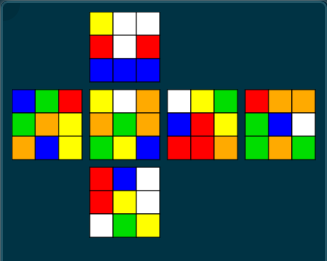

# Description
This is still a work in progress, but essentially what I'm aiming to do is 2 things: 
1) Expand the functionality of the [scrambler](https://github.com/RudainaK/RubiksCubeScrambler) to be displayed graphically (for now, through the terminal).
2) Solve the cube in its scrambled state. 

# The scrambler
In many online scrambles, you will see the following:

 *Image from [csTimer](https://www.speedcubingtips.eu/cstimer/src/)

My program displays this in the terminal using characters to correspond to colors

### Colors
|Color |Letter |
|------|-------|
|Blue  |B      |
|Green |G      |
|Red   |R      |
|Orange|O      |
|Yellow|Y      |
|White |W      | *

*Note that this is based off of the more common color schemes general seen on cubes. Somnetimes cubes can have different color schemes

The equivalent produced through the terminal

    YWW
    RWR
    BBB

BGR YWO WYG ROO
GOY OGO BRY GBW
OBY GYB RRO GOG
    
    RBW 
    RYW
    WGY

Where each block corresponds to a face.

